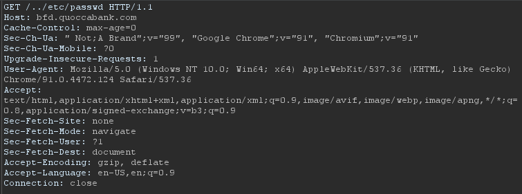
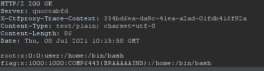
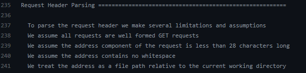

# Local file inclusion on 'bfd.quoccabank.com' 

## Report summary:

Local file inclusion on the root endpoint 'https://bfd.quoccabank.com/' present as a relative path injected into the GET requests. This is due to the fact that the web server treats file path inputs as a relative path to the working directory of the webserver.

## Severity : Critical

## Steps to reproduce:

Visit the site "https://bfd.quoccabank.com/" with Burp intercept turned on.

Send the request to repeater and modify the request to this:

Replacing the original `GET /index.html HTTP/1.1` with our custom payload  `GET /../etc/passwd HTTP/1.1`.

The response will be this:

## Impacts and Attack scenarios

Impacts of local file inclusion include the ability to view secret keys such as SSH keys, server config files such as flask secret keys leading to the attacker gaining the ability to forge their own authentication tokens, which may lead to vertical privilege escalation in the web app and may ultimately lead to remote code execution.

## Possible mitigations

Whilst security through obscurity is definitely not recommended here, do not outline the features of the web app on an open sourced repository for the world to see. 

As this comment on 'https://github.com/ajyoon/systemf/blob/master/examples/http/server.bf' outlines that there is a local file inclusion vulnerability existing in the webserver.

Other mitigations may be to use a non-vulnerable webserver, as well as sanitizing and checking whether or not the routes provided is part of a white listed list of routes.

