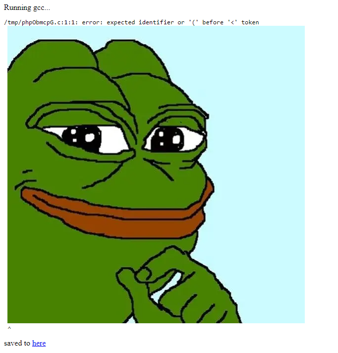
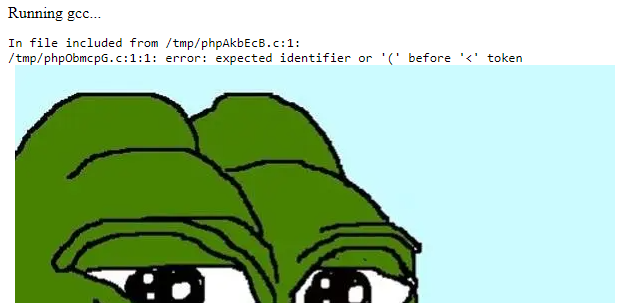
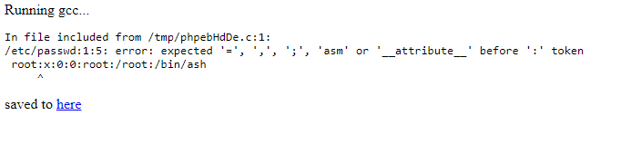
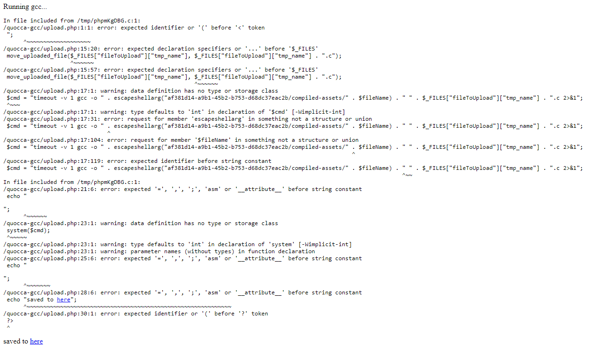
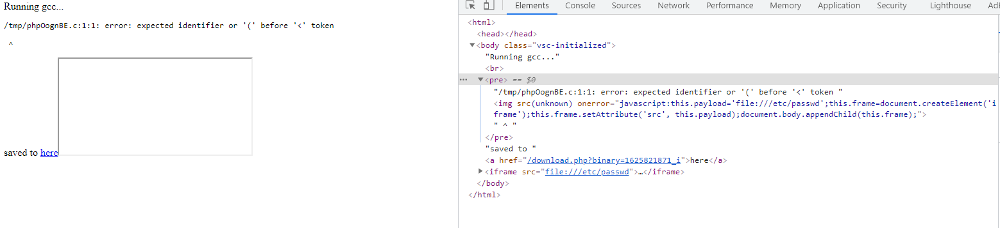

# Partial local file inclusion and stored xss on 'gcc.quoccabank.com' leading to possible Remote code execution

## Severity: High

## Report summary:

The 'https://gcc.quoccabank.com/' endpoint compiles any valid C source code on its servers then returns it back to the user to download. However it is noted that regardless of valid or invalid code, it will be logged and kept onto the server. Upon submitting a file with compilation errors, the errors are capable of reflecting back arbitrary javascript code. Furthermore, partial local file inclusion can be performed by using `#include "/filepath"`.

## Steps to reproduce:

Visit "https://gcc.quoccabank.com/" and upload any filename that ends with a '.c' extension

- this file can have any arbitrary code and the server will try to compile it

uploading this payload

`` 

the website reflects the image back as a 'warning' and it shows that the website is vulnerable to reflected XSS



furthermore, the `/tmp/phpObmcpG.c` path shown above is the file in which the error logs are saved in for this particular upload.

if we changed the payload to this `#include "/tmp/phpObmcpG.c"` it will also reflect back the image




Furthermore if the payload is changed once again to `#include "/etc/passwd"`



the reflected error message outputs the first line in the file in absolute path '/etc/passwd'

Utilizing this partial local file inclusion to examine the logic of the endpoint 'https://gcc.quoccabank.com/upload.php'

using payload `#include "/quocca-gcc/upload.php"`



the output highlights two things, there is a php function `system($cmd)` being called, that executes whatever is in the command and the command is a gcc command along with a user profiled `$filename` . Whilst the filename parameter itself is escaped, there could possibly be further attack methods to escalate this to a remote code execution vulnerability.

## Further attack scenarios and proof of concepts

Another attack vector is that since the XSS is stored in system logs, if the admin is ever to examine the logs, arbitrary javascript code will be able to run on the machine of a system administrator.

this payload example highlights the ability to add arbitrary javascript to the administrator's browser upon examining the file

```html

```



