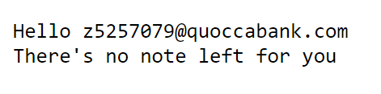
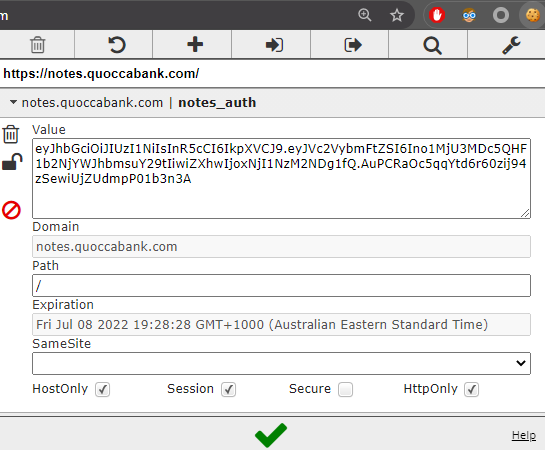
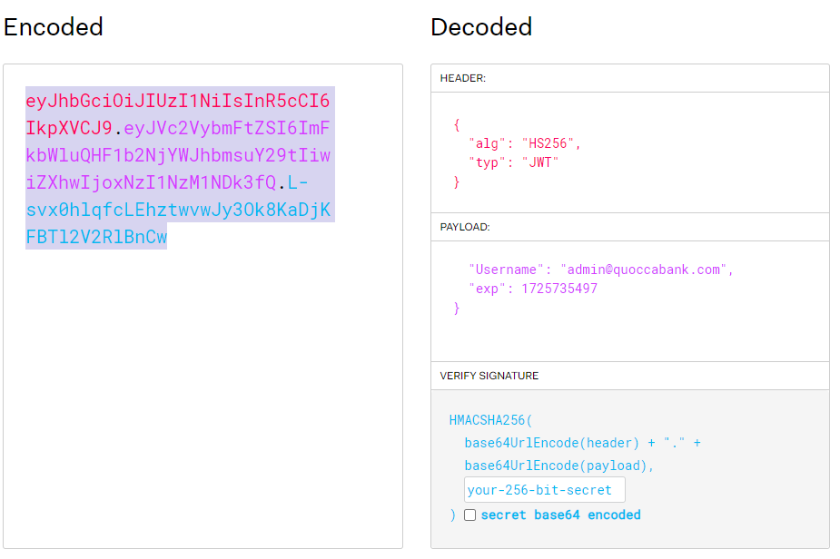
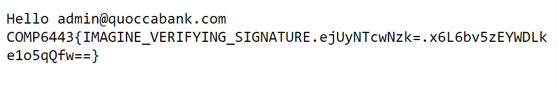

# Unverified  JWT token on 'notes.quoccabank.com' leads to vertical privilege escalation

## Severity: High

## Report summary:

The 'https://notes.quoccabank.com/' endpoint utilized a JWT token as its primary authentication token. Within this token includes two key value pair fields in its payload: Username and Expiry. Upon modifying the username to admin@quoccabank.com and the expiry time to a valid expiry time in the future, then submitting it to the website 'notes.quoccabank.com' response with text showing the user has been authenticated as admin.

## Steps to reproduce:

Visit "https://notes.quoccabank.com/" and grab the cookie from local storage or from a cookie editing plugin downloaded from your browser app store.

You will be faced with this information:

Grab the cookie from browser local storage or, in this case 'Editmycookie' (a chrome extension).

Paste the cookie into JWT.io, and change the payload to the following :

`Username: "admin@quoccabank.com"` `exp: "<some valid time in the future>"`

Replace the current JWT token in 'notes.quoccabank.com' and refresh

## Impact and attack scenarios

Vertical privilege escalation is a very severe vulnerability as it allows the attacker to gain more power over the website (by becoming admin), and may lead to them gaining a foothold onto the entire system.

## Mitigations

Mitigations include, verifying the JWT token on the backend to ensure integrity, furthermore do not use JWT as an authentication mechanism